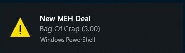
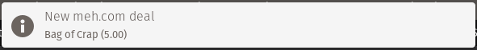

# Meh-rs

This is a binary application for consuming the [Meh.com API](https://meh.com/forum/topics/meh-api).

## Usage
The basic usage will simply return the JSON blob via `stdout` which is useful if you wanted to use
it a pipeline, though that isn't much different than using `curl`.

For more intersting use cases skip down to [watch](#watch)
```
$ meh --help
meh 
A cli tool for watching meh.com deals

USAGE:
    meh [SUBCOMMAND]

FLAGS:
    -h, --help       Prints help information
    -V, --version    Prints version information

SUBCOMMANDS:
    help     Prints this message or the help of the given subcommand(s)
    watch    
```
## Watch
This subcommad works like a deamon, reacting to a change in meh.com deal. On a normal day,
it will simply wait until the next time 12am eastern rolls around and request new information.

During a meh-ra-thon, it will use the end date provided on those kinds of items. There are
a few configuraton options, see below for more information.
```
meh-watch 

USAGE:
    meh watch [FLAGS] [OPTIONS]

FLAGS:
    -h, --help        Prints help information
    -p, --progress    If the cli should constantly report the current deal and when the next check will happen
    -V, --version     Prints version information

OPTIONS:
    -a, --alert <FILE>               Path to file that should be executed when the deal changes
    -t, --alert_type <alert-type>    Shape of the alert argument [default: title-price]  [possible values: title, title-
                                     price, json]
```
By default, this subcommand is pretty useless, however there are a few ways to get
some feedback from it, first is the `--progress` flag.

When the `--progress` flag is provided, the following will be printed to the screen and
updated periodically.
```
▒ Bag of Crap (5.00)
▒ https://meh.com/deals/bag-of-crap
▒ checking again in 12 hours at 10:00 pm
```
The first line is the title and the price, in USD. If there is more than one option, all prices will be included
in the parentheses. The next line will be a link directly to the item (your terminal might not treat it like a hyperlink though). The third line will let you know when the next update is, when it is more than an hour away, it will update each hour, in the last hour, it will update each minute.

The other interesting way to interact with the application is with the `--alert` flag.

When the `--alert` argument is provided, the program will attempt to execute the provided file (powershell on windows and sh on unix) when the deal changes.

There is a second argument that will control what information is passed to the alert script, `--alert_type`. By default
it will the first line of the progress text or, you could also pass `title` to just get the deal's title, or you could pass `json` for the full JSON blob that the meh api returns.

### Alert Example
#### Windows
```powershell
# ./alert.ps1
param (
    [string]$MSG = ""
)
Add-Type -AssemblyName System.Windows.Forms
$global:balmsg = New-Object System.Windows.Forms.NotifyIcon
$path = (Get-Process -id $pid).Path
$balmsg.Icon = [System.Drawing.Icon]::ExtractAssociatedIcon($path)
$balmsg.BalloonTipIcon = [System.Windows.Forms.ToolTipIcon]::Warning
$balmsg.BalloonTipText = $MSG
$balmsg.BalloonTipTitle = "New MEH Deal"
$balmsg.Visible = $true
Remove-Event notification_event -ea SilentlyContinue
Register-ObjectEvent $balmsg BalloonTipClicked -Action {
    Start-Process "https://meh.com"
}

$balmsg.ShowBalloonTip(20000)
Wait-Event -Timeout 20

```
This powershell script will create an alert bubble, which when clicked will
open the user's default browser to meh.com. The content of the alert is
provided by the $MSG argument

You could pass this as the alert argument to `meh.exe` and it will provide
a desktop alert when the deal changes. like so:
```powershell
meh.exe -a ./alert.ps1 -t title-price
```
Which might look like this:


#### Unix
This example assumes an Ubuntu system with `notify-send` installed, 

```bash
# ./alert.sh
notify-send "New Meh.com deal" "$1"
```
The above should display an alert that might look something like this:



#Download
The Releases tab above will have a pre-built copy for x86_64 Windows and Linux and MacOs as well as Arm7 Linux (RaspberryPi 3).

If you need a bespoke binary, you can build it using the Rust-Lang build tools [find out more here](https://rustup.rs).

The big caveat is that you would need to provide an API key in a file called `apikey` in the root directory. You can follow the instructions [here](https://meh.com/forum/topics/meh-api)

```
git clone https://github.com/FreeMasen/meh
cd meh
echo "MYKEYISSUPERSECRET" > apikey
cargo build --release --features bin
```


#Why
During a Meh-ra-thon, I wanted to have a way to get my computer to alert me when the deal turned over, so I built this.

#As a library
Since this is a Rust program, you could also use the types defined here in your own Rust application. I am not planning
on publishing this to Crates.io since it seems silly but you could use it like so:

```toml
# ./Cargo.toml
# ..snip..
meh = { git = https://github.com/FreeMasen/meh }
```

```rust
// ./src/main.rs

use meh::{Deal, Poll, Response, Video};
use serde_json::from_str();
fn main() {
    // get your json somehow
    let json = get_meh_json();
    let r: Response = from_str(&json);
    println!("{}", r.deal.title);
    println!("{}", r.poll.title);
    println!("{}", r.video.title);
}

fn get_meh_json() -> String {
    // get your json somehow
    // ..snip..
}

```